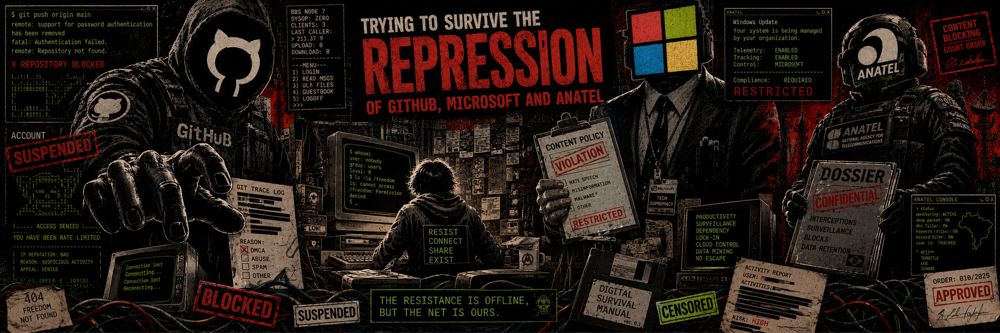

# surviving GITHUB, MICROSOFT, and ANATEL repression without spending a cent (1/2)



> _part 1 - AGMH / Anti GitHub & Microsoft Hysteria_

2026 was supposed to be the World Cup year. The year of "technology." The year of "artificial intelligence". A clean little poster for people who clap when a vendor prints the word agent on a slide.

The machine had other plans. In the same year:

* Anthropic shipped a Claude Code release with an internal debug/source-map packaging mistake that exposed the product's own source tree to the public.
* OpenAI got clipped through the TanStack npm supply-chain compromise. Two employee devices were hit, limited credential material was exfiltrated from internal repositories, and OpenAI had to rotate signing certificates used across its products.
* GitHub, owned by Microsoft, got popped through a poisoned VS Code extension on an employee device. Around 3,800 internal repositories were exfiltrated, according to GitHub's own incident write-up and press reporting.

That is already funny in the dry, ugly way only infrastructure failure can be funny. The companies selling the future could not keep their own update chains, developer endpoints, and release artifacts from leaking smoke.

But this text is not about laughing at their wreckage. Not only.

This is about what happens when you wake up in the middle of a repression campaign operated by GitHub, Microsoft, and ANATEL - yes, the Brazilian National Telecommunications Agency - while you are not even involved in the mess that started it.

I wrote this to document how that situation forced me to solve a distribution problem, give other people with the same problem some room to breathe, increase the availability of my own information, and add redundancy without spending a cent.

For the LULZ. For the record. For the network.

## 0x00 - the disclosure mess

Microsoft's communication around vulnerability disclosure is not exactly a clean signal. When MSRC is involved, the line between coordinated disclosure and corporate delay can get buried under tickets, templates, silence, and polite garbage.

In early April 2026, Dead Eclipse appeared on Blogspot with a post titled "Nightmare Eclipse: Public disclosure" and a GitHub repository called BlueHammer. BlueHammer was a Windows Local Privilege Escalation exploit that let a standard user reach `NT AUTHORITY\SYSTEM`. The interesting part was not a cheap buffer overflow or kernel panic. It abused trust and timing around Microsoft Defender update behavior, Volume Shadow Copy, Cloud Files callbacks, and oplocks. Defender could be made to open the window, then stare at the wrong thing while privileged material sat exposed.

From there, anyone with a minimally functioning brain could read the loop:

* MSRC stalls, dismisses, or fails to fix the actual class of bug.
* A researcher goes public with what Microsoft did not handle.
* Microsoft ships a late or partial patch.
* The same researcher publishes bypasses or adjacent exploits that walk around the weak patch.
* Microsoft tries again.
* Another public drop lands.

BlueHammer was not alone. RedSun, UnDefend, YellowKey, GreenPlasma, MiniPlasma, and later noise around BitLocker kept the same pattern alive: disclose, deny, patch around the edges, get embarrassed again. The moral theater around "responsible disclosure" is less convincing when the vendor only starts moving after public code hits the wire.

By May 2026, TeamPCP had infected a GitHub developer through a malicious VS Code extension and walked out with thousands of internal GitHub repositories. GitHub confirmed the poisoned-extension path and said the attacker's claim of roughly 3,800 repositories was directionally consistent with its investigation.

At the end of May, GitHub banned the Nightmare-Eclipse account. The researcher moved to GitLab. GitLab banned them too. Repo hosting platforms sent the usual message: public exploit code is acceptable right up until it makes the wrong company bleed in public.

Then, at the beginning of June 2026, GitHub started a ban wave around profiles that looked related, adjacent, suspicious, or just unlucky enough to match the smell of the campaign. In support tickets asking why accounts had been restricted, GitHub's answer looked like this:

> Our security team has recently been investigating suspicious activity and account hijacking, and we were concerned that your account may have been affected.
>
> Out of an abundance of caution, restrictions were placed on your account as part of our attempts to combat this campaign.

That is not a reason. That is a shrug with a ticket number.

## 0x01 - automatic suspension

In 2024, I went through MITRE's vulnerability disclosure process for `CVE-2024-44849`. That required a write-up and exploit material. Normal security work. Normal public record. Normal enough until some classifier starts sniffing for accounts that look like exploit publishers.

So, on June 8, 2026, near 4 AM in Brazil, my account was flagged and suspended.

The trigger was stupid. I had just forked a known security-techniques repository through the GitHub web UI so I could update my fork and send a pull request upstream. I clicked the fork, pressed `Alt+Tab` to clone it locally, and GitHub had already thrown me out.

The interface said:

> Your account is suspended.

Sessions died. Access died. The switch had flipped.

Timeline:

```text
Account suspended:      Monday, 2026-06-08 07:00 UTC
Review ticket opened:   2026-06-08 07:59 UTC
```

How do I know it was automatic? Because no human reviews an account, correlates disclosure history, checks a fork event, writes a decision, and kills every session in the time it takes to `Alt+Tab`. That was a rule firing. A bucket. A machine with no context and too much authority.

I wrote about it on X:

https://x.com/extencil/status/2065150696937115988

## 0x02 - then the wire went dark

GitHub did not answer fast enough. Other people who had been punished earlier were already posting that they were still banned. So I started saving whatever I could from `@extencil` and the `@haltman-io` organization.

That is when the network block appeared.

At first I thought GitHub had blocked my IP because the account was banned. Crude, but not impossible. Then the smell changed. This was not GitHub. This was Brazil's opaque blocking machinery.

Thiago Ayub had already been documenting this on X and in longer articles: ANATEL issues blocking orders under secrecy, and providers cannot simply tell a user, "this site is not broken, it was blocked by order." The user sees failure. The provider gets gagged. The regulator keeps the list in the dark.

That is how censorship likes to dress when it wants to pass as maintenance.

The ugly part is the mechanism. Ayub describes ANATEL's "Lacre Virtual" as a centralized blocking system that gives the agency remote control over edge-router and DNS blocking at major Brazilian providers. Instead of a provider's NOC applying a specific order with human hands on the box, the agency can push blocking commands into the infrastructure path.

IP. DNS. Edge. Silence.

That is not just a bad policy. That is a control surface.

And it gets worse with PL 4557/2024. The bill proposes to reorganize Brazilian Internet governance by moving strategic power over Internet governance, domain registration, and related critical resources toward ANATEL. Today, `CGI.br` and `NIC.br` sit in a multistakeholder model built over decades. They operate things that matter: `.br`, Registro.br, CERT.br, root-server instances hosted in Brazil, and `IX.br`, one of the largest Internet exchange points on the planet.

ANATEL is supposed to regulate telecommunications. Under this model it starts looking less like a regulator and more like the operator of the Brazilian Internet's critical control plane.

That is the state taking the NOC chair.

## 0x03 - this is not only Brazil

Brazil is not an isolated bug. It is one node in a wider failure mode.

Russia has been cutting developers off from foreign tools, including GitHub, Linux and Python repositories, and Figma, while Roskomnadzor floated a "state VPN" for developers who really need access. The translation is simple: first break the network, then sell permission back through a monitored pipe.

Spain has been running its own version of blunt-force blocking under the LaLiga anti-piracy regime. Vercel documented entire shared IP addresses being blocked, taking legitimate websites down with the alleged pirate targets. Vercel also noted collateral damage across Cloudflare, GitHub Pages, and BunnyCDN. TechRadar later reported that a Spanish court rejected LaLiga's request to fine NordVPN after NordVPN argued that blanket IP blocking breaks lawful services.

Different flags. Same packet damage.

The pattern is boring because it is always the same:

* A government, court, regulator, or private enforcement body wants a simple kill switch.
* The network is not shaped like their legal fantasy.
* They block at the wrong layer anyway.
* Shared infrastructure gets hit.
* Users see random failure.
* Operators eat the blame.
* The people who caused it call it enforcement.

This is not enforcement. It is packet carpet bombing with paperwork.

## 0x04 - why AGMH exists

From that point I started building AGMH - Anti GitHub & Microsoft Hysteria - under Haltman-IO.

The purpose is simple: stop depending on a single corporate forge, a single account, a single DNS path, or a single jurisdictional choke point to keep public information alive.

If a platform can disappear your account with a classifier and a canned support reply, treat that platform as volatile storage. If a regulator can blackhole access under secrecy, treat the national network path as hostile. If a vendor can leak its own source, rotate signing certs after a package compromise, and still posture as the adult in the room, treat its trust model as theater until proven otherwise.

AGMH exists because public technical work needs more than one place to live.

Git is cheap. Mirrors are cheap. Static pages are cheap. Archives are cheap. Distribution is a technical problem before it is a branding problem.

The fix does not need venture money. It needs discipline, replication, boring file formats, and a refusal to let corporate or state machinery become the only route to a text file.

Continued in part 2.

---

## sources / references

### corporate screwups and supply-chain wreckage

* https://www.axios.com/2026/03/31/anthropic-leaked-source-code-ai
* https://openai.com/index/our-response-to-the-tanstack-npm-supply-chain-attack/
* https://tanstack.com/blog/npm-supply-chain-compromise-postmortem
* https://techcrunch.com/2026/05/14/openai-says-hackers-stole-some-data-after-latest-code-security-issue/
* https://github.blog/security/investigating-unauthorized-access-to-githubs-internal-repositories/
* https://techcrunch.com/2026/05/20/github-says-hackers-stole-data-from-thousands-of-internal-repositories/
* https://www.bleepingcomputer.com/news/security/github-confirms-breach-of-3-800-repos-via-malicious-vscode-extension/
* https://therecord.media/github-confirms-teampcp-hack-customers-unaffected

### MSRC / Nightmare-Eclipse / exploit-hosting fallout

* https://www.cyderes.com/howler-cell/windows-zero-day-bluehammer
* https://www.threatlocker.com/blog/what-yellowkey-and-greenplasma-zero-day-exploits-reveal-about-trusting-native-windows-security
* https://blog.barracuda.com/2026/05/19/nightmare-eclipse-zero-days-grudge
* https://cybernews.com/security/gitlab-bans-rogue-researcher-releasing-windows-zero-days/
* https://www.huntress.com/blog/nightmare-eclipse-intrusion
* https://www.privacyguides.org/news/2026/05/15/bitlocker-bypass-found-researcher-warns-of-more-unreleased-vulnerabilities/
* https://www.tomshardware.com/tech-industry/cyber-security/microsofts-github-bans-security-researcher-who-posted-zero-day-windows-exploits-because-company-ruined-their-life-expert-claims-action-is-vindictive-and-promises-further-retaliation

### account suspension and prior disclosure record

* https://x.com/extencil/status/2065150696937115988
* https://nvd.nist.gov/vuln/detail/CVE-2024-44849
* https://blog.extencil.me/information-security/cves/cve-2024-44849
* https://github.com/extencil/CVE-2024-44849?tab=readme-ov-file
* https://docs.github.com/en/site-policy/acceptable-use-policies/github-appeal-and-reinstatement
* https://www.githubstatus.com/incidents/fcj3088jg1wx

### ANATEL / Lacre Virtual / Brazilian Internet governance

* https://x.com/ayubio/status/2064878070394183955
* https://x.com/ayubio/status/1999852008908480966
* https://x.com/ayubio/status/1999852016655355920
* https://nic.br/noticia/na-midia/quao-distante-o-brasil-esta-do-nepal-novas-leis-e-sistemas-de-bloqueio-aproximam-nacoes-da-fragmentacao-da-internet/
* https://www.tecmundo.com.br/seguranca/401627-venezuela-bloqueia-mais-de-40-acessos-de-internet-dns-vpn-e-tiktok.htm
* https://www.camara.leg.br/proposicoesWeb/fichadetramitacao?idProposicao=2472445
* https://www.camara.leg.br/noticias/1142896-projeto-fortalece-o-papel-da-anatel-na-governanca-da-internet/
* https://www.cgi.br/esclarecimento/nota-publica-sobre-o-projeto-de-lei-n-4-557-2024-que-propoe-redefinicao-do-modelo-vigente-de-governanca-da-internet-no-brasil/
* https://teletime.com.br/01/04/2025/anatel-apoia-pl-com-novo-modelo-de-governanca-para-internet-no-brasil/
* https://telesintese.com.br/projeto-propoe-anatel-como-supervisora-da-governanca-da-internet-brasileira/

### adjacent blocking regimes

* https://meduza.io/en/feature/2026/06/08/russia-s-internet-crackdown-is-cutting-developers-off-from-github-and-python-the-government-s-proposed-fix-a-vpn-controlled-by-the-government
* https://vercel.com/blog/update-on-spain-and-laliga-blocks-of-the-internet
* https://www.techradar.com/vpn/vpn-privacy-security/nordvpn-wins-crucial-legal-battle-in-spain-over-la-liga-piracy-fines
