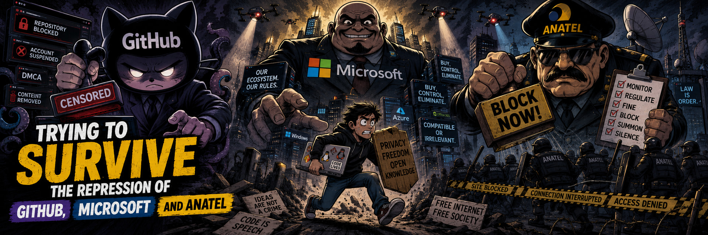

# surviving GITHUB, MICROSOFT, and ANATEL repression without a cent (2/2)



> _part 2 - AGMH / Anti GitHub & Microsoft Hysteria_

Part 1 ended where the wire got ugly: GitHub account suspension, ANATEL blocking noise, and the obvious conclusion that public technical work should not live behind one account, one forge, one DNS path, or one bureaucratic kill switch.

This part is the tool and the lesson.

When I started AGMH, the first scope was small:

* receive a GitHub profile as input;
* mirror everything readable from that profile to other forges;
* keep enough local state to resume when the network, token, or platform starts lying.

GitHub to GitLab. GitHub to Bitbucket. GitHub to Codeberg/Forgejo. GitHub to SourceHut.

Simple. Useful. Too narrow.

After talking with people around THC, Phrack, and other old circles, the pattern was obvious. Everybody who had been around long enough had lost data, links, repos, mailing-list context, release files, or project history somewhere. Everybody had a script. Everybody's script was ugly in a different way. Nobody was doing it because paranoia is fashionable. They were doing it because the machine had already eaten something once.

One reply to my X post said it plainly:

> I wish I weren't so lazy about this, I've been wanting to move to codeberg or foregejo for a bit now but I don't know how I want to begin to move them all despite how few projects I have

Then `@c0z` dropped the same diagnosis in the `0x00sec.org` Discord after seeing the first GitHub-coupled alpha:

> Make a post on 0x00sec about it and the background. I had a script to just clone shit for local storage but this is more lit af

That was the real spec.

Not "backup my GitHub." That is vendor-shaped thinking.

The real spec was:

> These are my accounts. These are my organizations. These are my groups. Pull the repos out. Keep mirrors. Push them somewhere else. Let me survive the next platform tantrum.

So the tool got split away from GitHub as the center of the universe. GitHub became one adapter. GitLab, Forgejo/Gitea, Codeberg, Bitbucket, SourceHut, and generic Git remotes became first-class targets.

The point is not to worship another forge. The point is to stop worshipping any forge.

## 0x05 - this failure mode is old

The 2026 mess was only the local trigger. The deeper bug has been around for years: developers keep rebuilding central points of failure on top of a decentralized VCS, then act surprised when the central point behaves like a central point.

Six examples are enough. More would just be archaeology.

### 2014 - Code Spaces got erased

Code Spaces was a code-hosting and project-management service. In June 2014, an attacker got into its AWS control panel during an extortion attempt. Data and backups were deleted. The company shut down.

The lesson is not subtle: a backup in the same blast radius is not a backup. It is decoration.

### 2015 - Google Code was turned off

Google Code did not need a dramatic breach. Google just killed it. New project creation was disabled in March 2015, the service went read-only later, and shutdown was scheduled for January 25, 2016.

No evil needed. Product death is enough.

### 2015 - SourceForge showed what hostile custody looks like

The GIMP Windows account mess on SourceForge became a clean warning. SourceForge argued the project was abandoned. GIMP and others saw account takeover and adware-wrapped distribution. Nmap's list called out the same pattern around mirrored projects and installer wrappers.

The lesson: if someone else controls the download path, they can put their hands between your users and your code.

### 2017 - GitLab.com deleted production data

GitLab's 2017 database incident is still one of the better public postmortems because it did not hide the blood. A production database was damaged, backups failed in several ways, and GitLab estimated losses around thousands of projects, comments, and accounts worth of database-side changes. Git repositories and self-managed installs were not the main casualty, but issues, comments, snippets, users, and project metadata were.

Git itself survived better than the forge wrapped around it.

That sentence should bother anyone who confuses "Git" with "GitHub."

### 2019/2020 - Bitbucket killed Mercurial support

Atlassian decided Bitbucket Cloud would stop supporting Mercurial. New Mercurial repositories were blocked, and existing Mercurial support and repositories were removed from Bitbucket Cloud and its API in 2020.

This one was not a breach either. It was roadmap gravity. A platform changed its mind, and users had to move.

### 2020 - youtube-dl vanished under DMCA pressure

GitHub removed `youtube-dl` after an RIAA DMCA notice, then reinstated it after additional review and pressure from the community and EFF. The project came back, but the point remains: a legal letter can flip a public repository offline before the argument is settled.

That is not resilience. That is custody.

## 0x06 - Git was already the answer, then we forgot

Git is not magic, but its original shape is hostile to single-master thinking.

Every clone carries history. Every remote is just a remote. A branch does not become more real because a web UI paints it green. A commit does not become safer because a platform put a mascot next to it.

Then the industry wrapped Git inside dashboards, permissions, CI vendors, issue trackers, badges, stars, OAuth apps, webhooks, and policy bots. Useful stuff, sure. Also a velvet rope around the repo.

People stopped saying "my repository is in Git" and started saying "my repository is on GitHub." That language leak matters. It turns a protocol into a landlord.

AGMH is not trying to replace Git. It is trying to drag people back to the part of Git that still works when the landlord locks the door.

## 0x07 - what AGMH is

AGMH means **Anti GitHub & Microsoft Hysteria**.

AGMH is a Python CLI for local Git repository backup and cross-forge mirroring. It discovers repositories from source accounts, organizations, groups, namespaces, or workspaces; clones them with Git; stores local mirrors; and pushes those mirrors to other forges.

Supported source and destination families:

* GitHub
* GitLab
* Forgejo / Gitea
* Codeberg
* Bitbucket
* SourceHut
* compatible Git remotes

Package:

https://pypi.org/project/agmh/

Repository:

https://github.com/haltman-io/agmh

Complete guide:

https://github.com/haltman-io/agmh/wiki/AGMH-COMPLETE-GUIDE

AGMH is released under the Unlicense. Use it, fork it, break it, fix it, ship it somewhere else. Permission is a bug.

## 0x08 - what it does

AGMH does the boring work that people keep postponing until after the ban, outage, takedown, credential compromise, sanction, acquisition, or shutdown notice.

It can:

* discover public and private repositories from supported providers;
* clone working trees when you need files on disk;
* create bare local mirrors with `git clone --mirror`;
* create destination repositories through forge APIs;
* push mirrors to one or more destinations;
* route API calls and Git HTTPS operations through an HTTP/HTTPS proxy;
* preserve branches, tags, and Git history;
* keep resumable state in `.agmh/state.json`;
* write logs under `.agmh/logs/`;
* poll for updates with `watching`;
* keep going when one repo fails instead of dropping the whole run.

It does not pretend Git history is the whole forge.

AGMH does **not** migrate issues, pull requests, merge requests, reviews, discussions, releases, CI secrets, project boards, branch protection rules, repository permissions, organization members, or every little dashboard artifact a platform invented to keep you parked there.

That is deliberate. Git first. Metadata later, if it is worth the damage.

## 0x09 - install

Use Python 3.11 or newer and Git.

```bash
python3 -m pip install -U pip
python3 -m pip install "agmh[tui]"
```

Check it:

```bash
agmh --help
agmh run --help
```

Ubuntu box:

```bash
sudo apt update
sudo apt install -y python3 python3-venv python3-pip git ca-certificates openssh-client
```

Optional:

```bash
sudo apt install -y git-lfs curl
```

## 0x0a - tokens

Use environment variables. Do not paste tokens into config files, shell history, logs, issues, pull requests, screenshots, or "temporary" notes that will live forever in some synced folder.

Common names:

```bash
export GITHUB_TOKEN="source_github_token_here"
export GITHUB_DEST_TOKEN="destination_github_token_here"
export GITLAB_TOKEN="gitlab_token_here"
export CODEBERG_TOKEN="codeberg_or_forgejo_token_here"
export BITBUCKET_TOKEN="bitbucket_app_password_or_token_here"
export SOURCEHUT_TOKEN="sourcehut_token_here"
```

Token rule:

* source token: read every repository you want to pull;
* destination token: create repositories and push refs where you want mirrors.

If the org uses SSO, authorize the token before running the tool. If the repo is private, make sure the token can see private repos. The API does not care about your assumptions.

Token pages:

* GitHub: https://github.com/settings/tokens
* GitLab: https://gitlab.com/-/user_settings/personal_access_tokens
* Codeberg: https://codeberg.org/user/settings/applications
* Bitbucket app passwords: https://bitbucket.org/account/settings/app-passwords/
* SourceHut OAuth tokens: https://meta.sr.ht/oauth

## 0x0b - quick start

Create a config:

```bash
agmh init-config --path agmh.config.toml
```

Create a source list:

```bash
cat > sources.txt <<'EOF'
https://github.com/YOUR_USER_OR_ORG/
EOF
```

Run a dry run first. Always.

```bash
agmh run --config agmh.config.toml --dry-run --verbose
```

Then do the real run:

```bash
agmh run --config agmh.config.toml --verbose
```

Check state:

```bash
agmh state --config agmh.config.toml
```

## 0x0c - Segfault.net via proxying

Proxy support was not a later decoration. AGMH carried it from the first version because a mirror tool that trusts the local path to the API is already half captured.

The ANATEL hit made that requirement concrete.

ANATEL had blocked the GitHub API path while I and other researchers were staring at work that could disappear behind a suspended account, a dead route, or both. At the same time, members of Haltman.IO and I were still shaping AGMH. No spare week to rent boxes, bring up clean infrastructure, harden it, document it, and hope the block lifted. The clock was smaller than the bureaucracy.

The fatality was old iron:

```bash
ssh root@segfault.net # password is 'segfault' (without quotes)
```

Segfault.net is a THC service: disposable root boxes, a public reverse TCP/UDP port option, and network egress outside the local mess. Ask the box for a port, start a temporary HTTP proxy, keep the shell open, and run AGMH through it.

On Segfault.net:

```bash
$ curl sf/port
Tip: Type cat /config/self/reverse_* for details.
Tip: Type rshell to start listening.
Tip: Type curl sf/port to assign a new port.
Your reverse Port is 83.143.242.45 31343 [83.143.242.45:31343]
```

```bash
gost -L http://:31343
```

On your workstation:

```bash
curl -I \
  --proxy http://83.143.242.45:31343 \
  https://api.github.com/users/extencil
```

Then move the mirrors:

```bash
agmh run \
  --config agmh.config.toml \
  --verbose \
  --proxy http://83.143.242.45:31343
```

Replace `83.143.242.45:31343` with the IP and port returned by `curl sf/port`. The proxy exists while the Segfault.net shell and the proxy process exist. Kill the shell, lose the route. Get a new port, update the command, continue.

If the proxy path breaks certificate verification and you understand why, add `--insecure` or `-k`. That disables certificate verification for API calls and sets `GIT_SSL_NO_VERIFY=true` for Git HTTPS operations. Useful under pressure. Bad as a habit.

This affects AGMH API calls and Git HTTPS operations. SSH pushes are a different wire. They do not magically obey an HTTP proxy because you wanted them to.

Do not confuse this with fighting ANATEL head-on. Head-on is stupid when the other side has public authority, state machinery, and enough paperwork to waste your month. ANATEL, in Brazil, carries public authority. That is the dangerous bit. Technical usefulness is optional. A patronage rack with a legal stamp can still blackhole your route and call it order.

GitHub has cash and a legal department built for extraction. My loose coins do not survive long against billions in revenue. Microsoft needs no sermon. What piled up in unpaid MSRC reports was already more than I had in the bank.

The sane move is disinvestment. Exit the wheel. Pull the work down. Push it elsewhere. Know that if GitHub dies tomorrow, or if a regulator blackholes the route again, the refs still exist on another platform.

That was the point of AGMH before the tool had a proper release tag. Not heroics. Not a manifesto with no payload. A shell, a socket, a mirror, and enough contempt for custody to move the work out.

## 0x0d - six useful runs

The full documentation has more. These are the ones most people actually need.

### 1 - local GitHub backup only

No destination. No remote creation. Just pull the repos into local bare mirrors.

```bash
export GITHUB_TOKEN="..."

agmh local-mirror \
  --source https://github.com/YOUR_USER_OR_ORG/ \
  --github-token env:GITHUB_TOKEN \
  --local-dir backups \
  --verbose
```

Result:

```text
backups/github/YOUR_USER_OR_ORG/*.git
.agmh/state.json
.agmh/logs/
```

### 2 - GitHub to GitLab

```bash
export GITHUB_TOKEN="..."
export GITLAB_TOKEN="..."

agmh run \
  --source https://github.com/YOUR_USER_OR_ORG/ \
  --github-token env:GITHUB_TOKEN \
  --destination https://gitlab.com/YOUR_GITLAB_NAMESPACE \
  --destination-token gitlab:env:GITLAB_TOKEN \
  --verbose
```

The destination is the namespace, group, or user where repositories should be created. It is not a single repository URL.

### 3 - GitHub to another GitHub account or org

Useful when you want a cold mirror under a different identity.

```bash
export GITHUB_TOKEN="..."
export GITHUB_DEST_TOKEN="..."

agmh run \
  --source https://github.com/SOURCE_USER_OR_ORG/ \
  --github-token env:GITHUB_TOKEN \
  --destination https://github.com/DESTINATION_USER_OR_ORG \
  --destination-token github:env:GITHUB_DEST_TOKEN \
  --verbose
```

### 4 - Codeberg or Forgejo to GitLab

```bash
export CODEBERG_SOURCE_TOKEN="..."
export GITLAB_TOKEN="..."

agmh run \
  --source https://codeberg.org/SOURCE_USER_OR_ORG/ \
  --source-token forgejo:YOUR_CODEBERG_USERNAME:env:CODEBERG_SOURCE_TOKEN \
  --destination https://gitlab.com/DESTINATION_NAMESPACE \
  --destination-token gitlab:env:GITLAB_TOKEN \
  --verbose
```

### 5 - local first, remote later

When the network is bad, the token is cursed, or you want to separate collection from publishing.

First:

```bash
export GITHUB_TOKEN="..."

agmh local-mirror \
  --source https://github.com/YOUR_USER_OR_ORG/ \
  --github-token env:GITHUB_TOKEN \
  --local-dir backups \
  --verbose
```

Later:

```bash
export GITLAB_TOKEN="..."

agmh remote-mirror \
  --config agmh.config.toml \
  --destination https://gitlab.com/DESTINATION_NAMESPACE \
  --destination-token gitlab:env:GITLAB_TOKEN \
  --verbose
```

### 6 - watch for updates

Polling. Not a webhook server. No exposed daemon waiting for the Internet to sneeze on it.

```bash
agmh watching \
  --config agmh.config.toml \
  --watch-interval 300 \
  --watch-action full \
  --verbose
```

## 0x0e - visibility and marker commits

Mirror source visibility:

```bash
agmh remote-mirror --config agmh.config.toml --destination-visibility mirror
```

Force private:

```bash
agmh remote-mirror --config agmh.config.toml --destination-visibility private
```

Force public:

```bash
agmh remote-mirror --config agmh.config.toml --destination-visibility public
```

Use `public` only after reviewing the repositories. AGMH cannot know your disclosure policy, your client obligations, your embargoes, or the stupid secret someone committed in 2019 and forgot.

By default, AGMH can add `agmh.txt` before remote mirroring. If you want a mirror without that content change:

```toml
[backup]
marker_enabled = false
```

## 0x0f - operational notes

Do not commit:

* `.agmh/`
* `backups/`
* `agmh.config.toml`
* `sources.txt`
* `destinations.txt`
* tokens
* logs
* private config files

Rotate tokens if they were printed, pasted, copied into tickets, leaked into logs, or handled by a machine you no longer trust.

Use `--insecure` only for controlled troubleshooting. It disables TLS verification. That flag is a scalpel, not a lifestyle.

Security reports:

```text
root@haltman.io
```

Do not open a public issue for private vulnerability details.

## 0x10 - what happened after the suspension

The account access incident that triggered this work followed this timeline:

```text
2026-06-08 07:00 UTC   account suspended by platform enforcement
2026-06-08 07:59 UTC   review ticket opened
2026-06-11 16:47 UTC   priority follow-up sent
2026-06-12 11:19 UTC   case reviewed and reverted by GitHub
```

GitHub eventually reverted the restriction. Good.

It changes nothing.

If the only reason you still have access to your own work is that a platform reviewed a ticket and decided to be merciful, you do not have continuity. You have a pending failure with nicer typography.

AGMH had already been used to back up repositories from `@extencil` and `@haltman-io` to GitLab, Codeberg, and SourceHut. That is the part that matters. Not the apology. Not the reversal. Not the ticket.

The mirror exists. The refs moved. The history breathes somewhere else.

## 0x11 - Haltman.IO

Haltman is a group of Brazilian hackers. Friends for over a decade. We build public, privacy-first infrastructure and free software.

We build, break, audit, and publish.

We do not sell platforms.

We do not run franchises.

We do not ask permission.

Links:

* Website: https://haltman.io/
* Alternate website: https://haltman.org/
* Contact: `root@haltman.io`, `root@haltman.org`
* Join: https://haltman.io/join/
* Telegram: https://t.me/haltman_group

### doctrine

| # | value |
| --- | --- |
| 01 | Independence. No board, no investors, no sponsors. Freedom needs no boardroom. |
| 02 | Transparency. Open tools, visible decisions, no back rooms. |
| 03 | Public output. Publish, document, release. The work speaks. |
| 04 | No hierarchy. No bosses, no titles, no org chart theater. Respect is earned by output. |
| 05 | Mutual aid. When one of us needs help, the others show up. No invoices, no politics. |
| 06 | No compromise. We do not trade principles for comfort, profit, or acceptance. |

## 0x12 - final packet

GitHub can ban you.

GitLab can block you.

Bitbucket can remove a VCS.

Google can shut down a forge.

A regulator can blackhole a path and call it enforcement.

A legal notice can make a repo disappear before the argument even starts.

So stop acting like one platform is home.

Home is the repo you can still clone when the dashboard is dead. Home is the mirror outside the blast radius. Home is the tarball on a disk you control. Home is the boring cron job that ran before the lawyers, classifiers, outages, and regulators arrived.

AGMH is not a revolution. It is a wrench.

Use it.

Break dependence.

Mirror the work.

For the LULZ.

For the record.

For the network.

---

## sources / references

### AGMH

* https://pypi.org/project/agmh/
* https://github.com/haltman-io/agmh
* https://github.com/haltman-io/agmh/wiki/AGMH-COMPLETE-GUIDE
* https://unlicense.org/

### proxy route

* https://www.thc.org/
* https://www.thc.org/segfault/

### token docs

* https://docs.github.com/en/authentication/keeping-your-account-and-data-secure/managing-your-personal-access-tokens
* https://docs.gitlab.com/user/profile/personal_access_tokens/
* https://docs.codeberg.org/advanced/access-token/
* https://support.atlassian.com/bitbucket-cloud/docs/app-passwords/
* https://man.sr.ht/meta.sr.ht/oauth.md

### historical continuity failures

* https://thehackernews.com/2014/06/cyber-attack-on-code-spaces-puts.html
* https://opensource.googleblog.com/2015/03/farewell-to-google-code.html
* https://arstechnica.com/information-technology/2015/05/sourceforge-grabs-gimp-for-windows-account-wraps-installer-in-bundle-pushing-adware/
* https://seclists.org/nmap-dev/2015/q2/194
* https://about.gitlab.com/blog/postmortem-of-database-outage-of-january-31/
* https://www.atlassian.com/blog/bitbucket/sunsetting-mercurial-support-in-bitbucket
* https://github.blog/news-insights/policy-news-and-insights/standing-up-for-developers-youtube-dl-is-back/
* https://www.eff.org/deeplinks/2020/11/github-reinstates-youtube-dl-after-riaas-abuse-dmca

### local trigger and part 1 background

* https://x.com/extencil/status/2065150696937115988
* https://x.com/Rockarmy321/status/2065369723475214446
* https://github.blog/security/investigating-unauthorized-access-to-githubs-internal-repositories/
* https://www.bleepingcomputer.com/news/security/github-confirms-breach-of-3-800-repos-via-malicious-vscode-extension/
* https://nic.br/noticia/na-midia/quao-distante-o-brasil-esta-do-nepal-novas-leis-e-sistemas-de-bloqueio-aproximam-nacoes-da-fragmentacao-da-internet/
